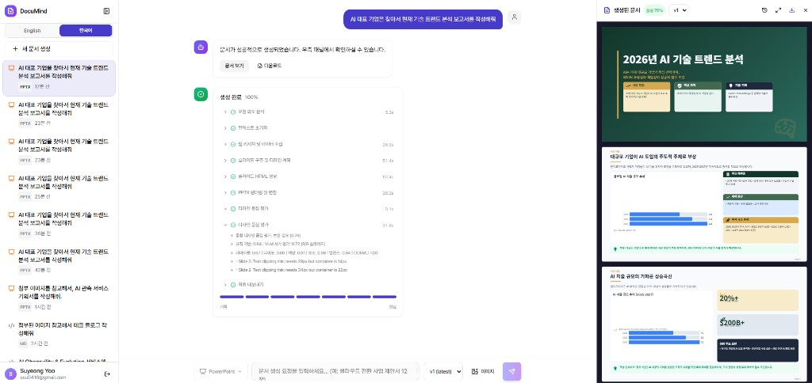

# DocuMind

**Agentic AI Document Generation Platform**  
Natural language request -> agentic planning/design/generation -> production-ready native document output.

Korean version: [`README.ko.md`](README.ko.md)

DocuMind provides both:
- A full-stack app (`FastAPI` + `Next.js`) for collaborative generation and iterative revision
- A package-style SDK/engine API for API-free local or embedded generation



---

## Service Overview

DocuMind is built for teams that need high-quality business documents without manually composing every page.  
The system coordinates specialized agents to interpret intent, design structure, generate format-native content, run quality checks, and export final files.

### What It Is Good At

- Transforming rough prompts into structured, presentation/report-ready outputs
- Preserving template style while replacing/adding requested content
- Producing native files directly (not only HTML mockups)
- Supporting iterative edits with version history and preview endpoints

### Core Capabilities

- Multi-format generation: `PPTX`, `DOCX`, `PDF`, `Markdown`, `XLSX`, `HWPX`
- Agentic orchestration with optional web research and quality feedback loops
- Template-aware generation (uploaded native templates can be populated directly)
- API + Web UI + package engine + CLI in one repository

---

## Agentic Workflow

DocuMind routes every request through format-specific pipelines (for example `src/formats/pptx/orchestrator.py` and `src/formats/rich_document/orchestrator.py`).

### Stage 1) Intent & Planning
- Understand user intent and output language
- Infer document archetype and whether external research is needed
- Build a document plan (`document_spec`, sections/blocks/metadata)

### Stage 2) Design System
- Select or infer template family and visual language
- Build a format-aware design system (colors, typography, layout/component treatment)
- Respect uploaded templates as authoritative when required

### Stage 3) Native Generation
- Render into native target format with format-specific renderer/orchestrator
- Persist generated artifact and metadata (score, section count, pipeline state)
- Support streaming progress events for app/SDK integrations

### Stage 4) QA & Export
- Evaluate quality/fidelity and iterate when needed
- Publish final file and expose download/preview/version endpoints
- Return machine-usable result objects (`GenerationResult`) for SDK users

---

## Generated Documents

Available outputs:
- `pptx` presentation decks
- `docx` formal reports, forms, proposals
- `pdf` publication-style reports
- `md` technical articles/spec notes
- `xlsx` worksheet/table-oriented documents
- `hwp` Korean office-document workflow support

Each run stores generation metadata (e.g., quality score, plan/design context, versions) for later revision and governance.

---

## Quick Start (Local)

### Prerequisites
- Python `3.11+`
- Node.js `18+`

### Install

**Windows (PowerShell)**
```powershell
copy .env.example .env
npm run install:all
```

**Linux/macOS**
```bash
cp .env.example .env
npm run install:all
```

### Environment

Set provider credentials in `.env`.  
For web UI, set `web/.env.local`:

```bash
NEXT_PUBLIC_API_URL=http://localhost:8000
```

### Run

```bash
npm run dev
```

- Web: `http://localhost:3000`
- API: `http://localhost:8000`
- OpenAPI: `http://localhost:8000/docs`

Useful commands:

```bash
npm run dev:api
npm run dev:web
python -m src.cli generate "12-slide cloud migration proposal"
```

---

## SDK / Engine Usage

DocuMind can be consumed directly from Python without running the API server.

```python
import asyncio
from src.engine import DocuMind

async def main():
    engine = DocuMind(
        llm_provider="openai",
        default_llm_model="gpt-4o",
    )
    result = await engine.generate(
        query="Create a 10-slide AI strategy deck for 2026",
        format="pptx",
        locale="ko",
    )
    print(result.success, result.output_path)

asyncio.run(main())
```

Also available:
- `generate_document(...)` for one-shot convenience
- `generate_stream(...)` / `engine.generate_stream(...)` for streaming progress events

---

## Infrastructure Setup and Destroy

For single-host AWS deployment assets, see:
- `setup/README.md` (English)
- `setup/README.ko.md` (Korean)

`setup` includes both provisioning and teardown scripts:
- Apply: `setup/ec2/terraform/single/tf-apply.sh` / `tf-apply.ps1`
- Destroy: `setup/ec2/terraform/single/tf-delete.sh` / `tf-delete.ps1`

Terraform direct command:

```bash
cd setup/ec2/terraform/single
terraform destroy
```

---

## Open Source Acknowledgements

DocuMind is built on top of many open-source projects:

- Backend/API: `FastAPI`, `Uvicorn`, `SQLAlchemy`, `Pydantic`
- Agentic runtime: `LangGraph`, `LangChain`
- LLM/Provider integrations: `OpenAI SDK`, `Anthropic SDK`, `Boto3`
- Document/rendering stack: `python-pptx`, `PyMuPDF`, `Playwright`, `lxml`, `Pillow`
- Frontend: `Next.js`, `React`, `Tailwind CSS`, `Zustand`

Dependency policy and allowed licenses are managed in `pyproject.toml`.

---

## License

Apache License 2.0.  
See `LICENSE` for details.

## Contact

Suyeong Yoo — `ssu0416@gmail.com`
